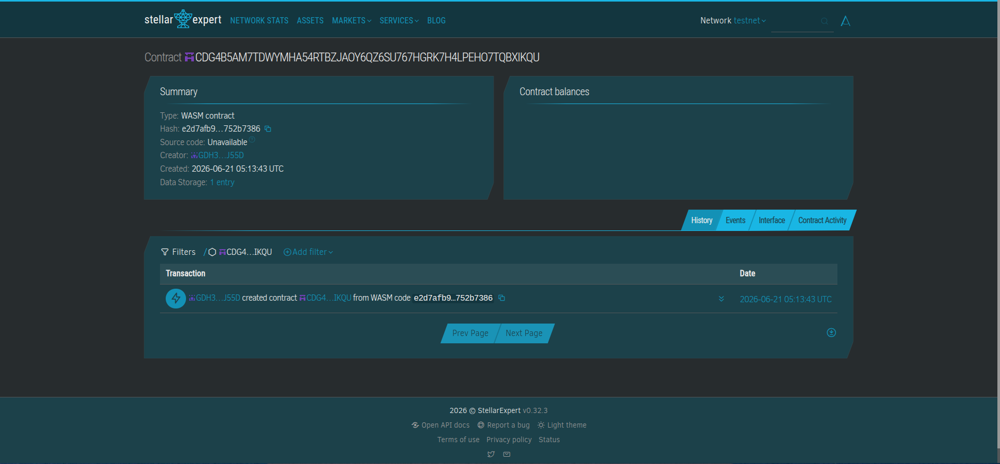

# FaithLedger

FaithLedger is a transparent, zero-leakage digital tithe and offering coordination engine built on Soroban.

## Problem & Solution
Physical cash offerings in rural regions face security and storage friction, while global migrant congregants face crippling $10\%–15\%$ payment rail losses just trying to support local home ministries. FaithLedger solves this by enabling programmatic micro-donations using cheap, fiat-pegged Stellar assets routed directly into automated allocations.

## Timeline
* **Phase 1:** Contract Architecture Execution & Local Test Suites (Current Status)
* **Phase 2:** Stellar Anchor Connection for Local Off-Ramps
* **Phase 3:** Mobile PWA Wallet Integration for End-User Deployments

## Stellar Features Used
* **USDC / Local Stablecoin transfers** for fast settlement and low friction.
* **Soroban Smart Contracts** for on-chain accounting allocations.
* **Trustlines** to secure valid network compliance paths.

## Vision and Purpose
To empower grassroots, faith-based institutions with transparent cryptographic financial systems that route cross-border support straight to community impact initiatives without intermediary fee extractions.

## Prerequisites
* Rust `v1.75.0` or higher
* Soroban CLI `v20.0.0` or higher
* Target `wasm32-unknown-unknown` installed

## How to Build




```bash
soroban contract build

CDG4B5AM7TDWYMHA54RTBZJAOY6QZ6SU767HGRK7H4LPEHO7TQBXIKQU
